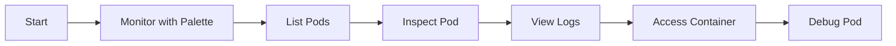

# Debug Operations in Kubernetes

`kubectl` is the command-line interface (CLI) tool used to interact with and manage Kubernetes (K8s) clusters. It lets you communicate with the K8s API server and execute commands against a K8s cluster to deploy applications, manage resources, or view logs.

`kubectl` is also an essential tool for diagnosing and debugging issues with your applications. With `kubectl`, you can access and investigate pod status, configurations, and container logs. For advanced users, you can even attach temporary debugging containers to running workloads.

In Spectro Cloud's Palette, you can use these `kubectl` commands alongside the Palette UI or CLI to troubleshoot clusters managed across cloud, on-premises, or hybrid environments. Palette's dashboard provides visual insights into pod health, which you can complement with `kubectl` for comprehensive debugging.

This guide outlines the most common `kubectl` commands and a recommended workflow for effective troubleshooting.

## Recommended Debugging Workflow

When debugging, we recommend this workflow:

1. Use Palette's cluster dashboard to monitor pod metrics and alerts in real time, then apply these `kubectl` commands for deeper investigation.
2. `kubectl get pods`: Gives you an inventory of the pods in your K8s cluster.
3. `kubectl describe pod`: Gives you a snapshot of a specific pod's current state and configuration.
4. `kubectl logs`: Gives you the standard output (`stdout`) and standard error (`stderr`) streams from a container running a pod.
5. `kubectl exec`: Lets you execute a command directly inside a running container in a pod.
6. `kubectl debug`: Creates a temporary debug container to a running pod for advanced troubleshooting when `exec` is insufficient.



## `kubectl get pods`

Use this command to get a list of pods in a given [namespace](https://kubernetes.io/docs/concepts/overview/working-with-objects/namespaces/). It lists their status, health, and age. Execute this command first to check pod health.

The command executes against your current context's namespace unless you specify a namespace with `--namespace` (or, simply `-n`):

```shell
kubectl get pods                    # current namespace
kubectl get pods -n <namespace>     # specific namespace
kubectl get pods -A                 # all namespaces
kubectl get pods -o wide            # include IP, NODE, etc.
```

To set a working namespace, so you don't need to repeat it everywhere:

```shell
kubectl config set-context --current --namespace <namespace>
```

In Palette, you can view a similar pod inventory in the cluster overview dashboard, which highlights health and status alongside `kubectl get pods` output.

### Example output and explanation

```text
$ kubectl get pods
NAME                                       READY   STATUS             RESTARTS      AGE
frontend-deployment-78b7999885-2sk6j       1/1     Running            0             13m
mysql-76c74d896b-4g8b8                     1/1     Running            0             13m
webapp-deployment-559d86b864-sk7r9         0/1     CrashLoopBackOff   4             2m
```

- `NAME`: The name of the pod
- `READY`: The number of ready containers / the number of total containers
- `STATUS`: Current state of the pod: `Running`, `Pending`, `Succeeded`, `Failed`, or `CrashLoopBackOff`
- `RESTARTS`: How many times the containers in the pod have restarted
- `AGE`: The amount of time elapsed since creation of the pod

For more info, available flags, and example commands, refer to [`get` on K8s docs](https://kubernetes.io/docs/reference/generated/kubectl/kubectl-commands#get).

## `kubectl describe pod`

Use this command to get a detailed, human-readable view of a specific pod or a set of pods in a K8s cluster. While `kubectl get pods` gives a summary, `describe` pulls details from multiple sources to show the pod's full state and setup. It is an essential tool for troubleshooting pod-related issues.

### Example output and explanation

```text
Name:             api
Namespace:        prod
Node:             ip-10-0-2-11/10.0.2.11
Start Time:       Tue, 03 Sep 2025 10:07:11 -0600
Labels:           app=api
Status:           Pending
IP:               <none>
Containers:
  api:
    Image:        registry.example.com/team/api:2.0.0
    State:        Waiting
      Reason:     ImagePullBackOff
    Ready:        False
    Restart Count: 0
Conditions:
  Type              Status
  Initialized       True
  Ready             False
  ContainersReady   False
  PodScheduled      True
Events:
  Type     Reason          Age                 From     Message
  ----     ------          ----                ----     -------
  Normal   Pulling         3m                  kubelet  Pulling image "registry.example.com/team/api:2.0.0"
  Warning  Failed          3m                  kubelet  Failed to pull image "registry.example.com/team/api:2.0.0": rpc error: ...
  Warning  Failed          3m                  kubelet  Error: ErrImagePull
  Warning  BackOff         2m (x3 over 3m)     kubelet  Back-off pulling image "registry.example.com/team/api:2.0.0"
  Warning  Failed          2m                  kubelet  Error: ImagePullBackOff
```

In this example, the image can't be pulled. Things you would verify:

- Image name/tag exists and is spelled correctly
- Registry credentials/Secret on the ServiceAccount
- Network/DNS to the registry
- If using Palette to manage this cluster, verify the registry pack is correctly configured in the cluster profile

For more info, available flags, and example commands, refer to [`describe` on K8s docs](https://kubernetes.io/docs/reference/generated/kubectl/kubectl-commands#describe).


## `kubectl logs`

Use this command to retrieve and display the standard output (`stdout`) and standard error (`stderr`) streams from a container running in a pod. While `kubectl get pods` tells you if a pod is healthy, `kubectl logs` gives you visibility into what the application inside the container is doing.

### Example output and explanation

```text
$ kubectl logs frontend-deployment-78b7999885-2sk6j
/docker-entrypoint.sh: /docker-entrypoint.d/ is not empty, will attempt to perform configuration
/docker-entrypoint.sh: Looking for shell scripts in /docker-entrypoint.d/
/docker-entrypoint.sh: Launching /docker-entrypoint.d/10-listen-on-ipv6-by-default.sh
10-listen-on-ipv6-by-default.sh: info: /etc/nginx/conf.d/default.conf is not a file or does not exist
/docker-entrypoint.sh: Launching /docker-entrypoint.d/20-envsubst-on-templates.sh
/docker-entrypoint.sh: Launching /docker-entrypoint.d/30-tune-worker-processes.sh
/docker-entrypoint.sh: Configuration complete; ready for start up
10.42.0.1 - - [03/Sep/2025:13:20:45 +0000] "GET / HTTP/1.1" 200 612 "-" "Mozilla/5.0 (Macintosh; Intel Mac OS X 10_15_7) AppleWebKit/537.36 (KHTML, like Gecko) Chrome/128.0.0.0 Safari/537.36" "-"
10.42.0.1 - - [03/Sep/2025:13:20:50 +0000] "GET / HTTP/1.1" 200 612 "-" "Mozilla/5.0 (Macintosh; Intel Mac OS X 10_15_7) AppleWebKit/537.36 (KHTML, like Gecko) Chrome/128.0.0.0 Safari/537.36" "-"
```

The logs show the raw output of what your application is doing inside the container. You'll typically get:

- Startup and system messages: Initialization messages, system and informational output, warnings and errors
- Runtime logs: Application-specific data, error stack traces and exceptions, debugging output

With Palette, you can access centralized logs for your cluster in the UI, complementing `kubectl logs` for quick application-level debugging.

For more info, available flags, and example commands, refer to [`logs` on K8s docs](https://kubernetes.io/docs/reference/generated/kubectl/kubectl-commands#logs).

## `kubectl exec`

Use the `kubectl exec` command to execute a command directly inside a running container within a pod. It provides interactive access to the container's shell and environment, which is powerful for live debugging and troubleshooting.

### Example output and explanation

```text
$ kubectl exec frontend-deployment-78b7999885-2sk6j -- cat /etc/hosts
127.0.0.1       localhost
::1     localhost ip6-localhost ip6-loopback
fe00::0 ip6-localnet
ff00::0 ip6-mcastprefix
ff02::1 ip6-allnodes
ff02::2 ip6-allrouters
10.42.0.12 frontend-deployment-78b7999885-2sk6j
```

The output depends on the command you execute once you enter the interactive session.

When using Palette, ensure your user role has permissions to execute commands in containers, as defined in the cluster's security policies.

For more info, available flags, and example commands, refer to [`exec` on K8s docs](https://kubernetes.io/docs/reference/generated/kubectl/kubectl-commands#exec).

## `kubectl debug`

Use this command for advanced troubleshooting, when all other methods have proven insufficient. These are the most common use cases:

- **Create an ephemeral (temporary) container in a running pod**: `kubectl debug` creates and adds a temporary, interactive container to an existing pod that lets you inspect the running processes and files of the original container without modifying or restarting it.
- **Copy and modify a pod**: If ephemeral containers are not enabled in your cluster or you need to test a specific change, `kubectl debug` can create a copy of the pod. You can then add a debugging container to the pod copy for testing. It's an isolated way to test a fix without affecting the live workload.
- **Debug a cluster node**: `kubectl debug` can create a new pod that runs directly on a specific node, mounting the host's filesystem at `/host`. This creates an SSH-like shell on the node itself, letting you troubleshoot node-level issues like networking problems, log analysis, or filesystem issues without a true SSH connection.

In Palette-managed clusters, you can use the UI to inspect node health alongside `kubectl debug` for node-level troubleshooting, like checking system logs or network configurations.

### Example output and explanation

The output of `kubectl debug` depends on the debugging mode you use. The most common use case is adding an interactive ephemeral container to a running pod:

```text
$ kubectl debug -it mypod --image=busybox --target=main-app
Defaulting debug container name to debugger-d4fsh.
If you don't see a command prompt, try pressing enter.
/ # ls -l /proc/1/
total 0
dr-xr-xr-x 8 root root 0 Sep  3 15:00 attr
-r-------- 1 root root 0 Sep  3 15:00 autogroup
-r-------- 1 root root 0 Sep  3 15:00 cgroup
# ... (rest of the /proc/1 directory output) ...
/ # exit
exit
```

For more information, refer to [kubectl debug](https://kubernetes.io/docs/reference/generated/kubectl/kubectl-commands#debug).

## References

- [Spectro Cloud Palette docs](https://docs.spectrocloud.com/)
- [Kubectl commands (official docs)](https://kubernetes.io/docs/reference/generated/kubectl/kubectl-commands)
- [Kubernetes Overview (official docs)](https://kubernetes.io/docs/concepts/overview/)
